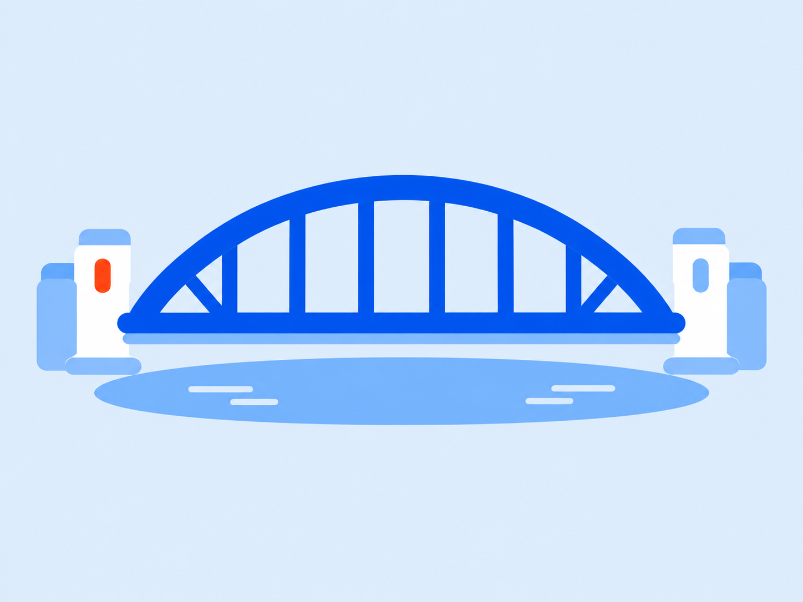
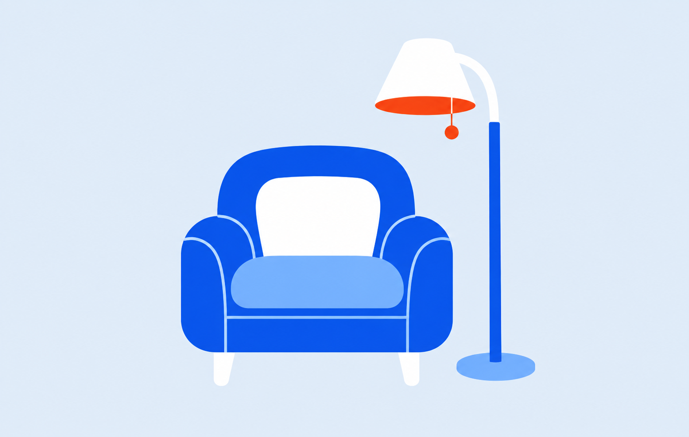
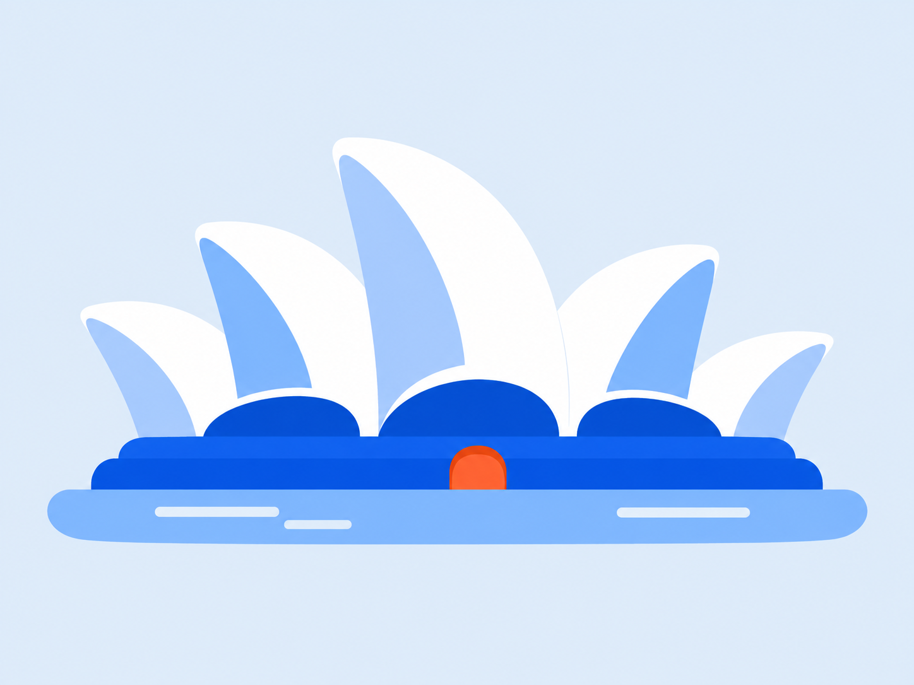
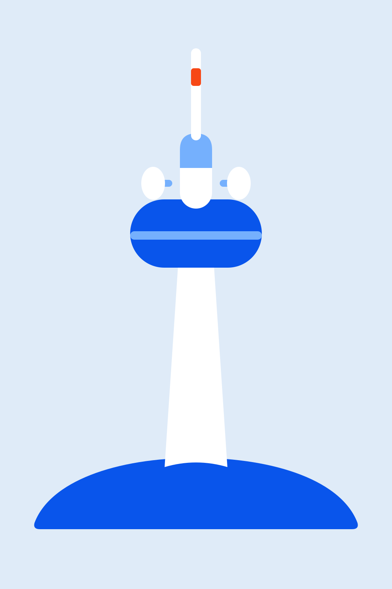

# GIO Marshmallow Illustration Style

A reusable guide for creating soft, friendly GIO illustrations from simple rounded forms, bright colour and generous breathing room.

## Visual references

The written rules below take precedence over older example images. Use the Harbour Bridge
and updated Opera House for the current detail level and 4:3 framing, and the flat Telstra Tower for solid-fill
construction. Earlier references show the rounded forms and palette; do not copy their gradients.

### Sydney Harbour Bridge — 4:3, modest detail



### Armchair and standing lamp



### Coffee shop


### Sydney Opera House — 4:3, modest detail



### Canberra Telstra Tower — Figma-ready flat construction



## Style in one sentence

GIO Marshmallow uses a few large, softly inflated geometric shapes, bright cobalt and sky blue, a tiny warm orange-red accent and a fresh pale blue-white background to create illustrations that feel simple, rounded, optimistic and immediately recognisable.

## Core principles

### Marshmallow shape language

- Construct the subject from a small number of large, soft forms.
- Favour pills, capsules, rounded rectangles, broad arches, plump cushions and smooth lozenges.
- Make corners generously rounded and transitions gentle.
- Avoid needle points, hard triangular wedges, sharp corners and brittle technical geometry.
- An identifying tip or peak may taper, but soften its surrounding curve so it never feels spiky.
- Keep forms slightly inflated and friendly without turning them into glossy 3D objects.

### Simplicity and detail

- Use one clear hero silhouette and a small set of supporting rounded forms.
- Aim for a modestly detailed illustration with about four to six purposeful detail groups.
- Examples include a cap or rim, an inset opening, a seam, a deck edge or a few structural braces.
- Treat repeated structural elements as one sparse group. Keep them broad and well spaced.
- Use details that remain readable at a small display size; simplify anything that turns into visual noise.
- For architecture, suggest windows and entrances with broad panels; never draw a grid of individual panes.
- Remove seams, lines or accessories that do not materially improve recognition.
- The result should feel a little richer than a basic icon while retaining the friendly Marshmallow silhouette.

### Finish

- Use clean, opaque vector shapes with crisp outer edges.
- Every shape uses one uniform solid colour from edge to edge.
- Use no gradients, shadows, transparency, blur, glow, lighting effects or blend modes.
- Build all depth through separate overlapping shapes selected from the approved palette.
- Keep the construction simple enough to recreate directly in Figma.
- Do not use grain, noise, speckling, paper texture, a sandpaper effect, grey wash, haze or distressed edges.
- Avoid outlines where overlapping colour shapes can define the form.

## Composition

- Default canvas: 4:3 landscape (for example 1600 × 1200 px). Use another ratio only when explicitly requested.
- Compose directly for that canvas; do not stretch the artwork or crop a wide banner to fit.
- Show the complete subject with at least 12–15% clear space on every side.
- Nothing important may touch or cross the canvas edge.
- Let the complete subject occupy roughly 65–75% of the canvas width, with height governed by its natural proportions and the same safe margins.
- Keep the visual weight calm, open and balanced.
- Use a straight-on front view for buildings and storefronts.
- Use a front or very gentle three-quarter view for individual objects.
- Do not use isometric perspective unless explicitly requested.
- Start every brief as a fresh composition; never carry over objects from a previous illustration.

## Approved colour palette

These colours were sampled from the approved GIO Marshmallow armchair reference.

| Role | Colour | Hex |
| --- | --- | --- |
| Dominant structure | Cobalt blue | `#0955EB` |
| Secondary surfaces | Sky blue | `#75B0FD` |
| Soft secondary plane | Soft blue | `#A8CDFC` |
| Main background | Pale blue-white | `#DFEBF8` |
| Highlights | White | `#FFFFFF` |
| Small accent only | Warm orange-red | `#F74816` |

Use cobalt for the main mass, sky blue for secondary forms, white for highlights and warm orange-red for only 2–5% of the image. Use `#DFEBF8` as one uniform background fill.

Do not substitute the older corporate navy `#005296`, deep blue `#014A73` or dark red `#E3001B`. Avoid unrelated greens, browns, yellows, purples, black and neutral greys.

## Subject guidance

### Objects and furniture

- Build the object from broad rounded masses with a strong silhouette.
- Use one or two large seams or insets only when needed for recognition.
- Make cushions, handles, shades and bases feel soft and comfortably proportioned.
- Use a single pill-shaped grounding form when the subject needs weight.

### Architecture and storefronts

- Use a simplified front elevation.
- Preserve the recognisable roofline or facade as one soft hero silhouette.
- Represent glazing, doors and signs as a few large rounded panels.
- Use a simple pictogram instead of words or generated branding.
- A few broad structural braces, pylon caps, panel divisions and a simple deck edge may add useful definition.
- Do not include dense window grids, masonry lines, fine railings or architectural micro-detail.

### People

- Use simplified elongated proportions with soft joints and an expressive pose.
- Include minimal friendly facial features when visible: small eyes and a simple mouth or nose.
- Keep hair and clothing as large rounded colour blocks.
- Vary posture between illustrations; do not reuse the same figure.

## Master prompt

```text
Create one original GIO Marshmallow illustration of [SUBJECT].

Build the subject from a small number of large, softly inflated geometric shapes. Favour
pills, capsules, rounded rectangles, broad arches and smooth lozenges. Use one clear hero
silhouette, a small set of supporting forms and about four to six purposeful detail groups.
Use broad well-spaced structural accents, insets or seams to add a little more definition.
Make corners generously rounded and soften any necessary peak or tip. The result
should feel simple, friendly and modern—not sharp, technical or architecturally literal.

Use cobalt blue #0955EB as the dominant colour, sky blue #75B0FD and soft blue #A8CDFC
for secondary shapes, white #FFFFFF for highlights, and warm orange-red #F74816 for only
one small accent. Use one uniform pale blue-white #DFEBF8 background. Every shape must
use one solid opaque fill. Create depth only with separate overlapping colour shapes.

Use a 4:3 landscape canvas, such as 1600 × 1200 px. Compose directly for this aspect ratio.
Show the complete subject with 12–15% clear space on every side. Let it occupy roughly
65–75% of the width, keeping its natural proportions. Keep the composition calm and balanced. Use a straight-on front
view for architecture and a front or very gentle three-quarter view for objects.

No text, logos or pseudo-lettering. No cropping, edge collisions, isometric view,
photorealism, hard 3D, sharp spikes, acute corners, tiny architectural detail, window
grids, gradients, glossy lighting, bevels, realistic shadows, dark vignette, noise,
grain, speckles, paper texture, sandpaper effect, grey wash, haze or distressed edges.
Do not reuse objects or motifs from earlier requests unless explicitly requested.
```

## Example subject briefs

### Armchair and standing lamp

```text
A welcoming armchair beside a standing lamp. Build the chair from four broad rounded
forms: an arched back, two pill-shaped arms and one plump seat cushion. Give the lamp a
soft bell-shaped shade, one rounded stem and an oval base. Add one small orange-red pull
cord. Keep both objects complete and comfortably spaced.
```

### Coffee shop

```text
A complete front-facing neighbourhood coffee shop. Simplify the facade into one rounded
blue frame, one broad striped awning, two large pale-blue window panels and one soft-edged
door. Add only a cup-and-steam pictogram, a simplified coffee machine shape and one small
bistro-table shape. No lettering, window grids or architectural micro-detail.
```

### Sydney Opera House

```text
The complete Sydney Opera House as a soft front-facing harbour elevation on a 4:3 canvas.
Use five broad, rounded sail-shell forms with softened tips, a low rounded cobalt podium
and one sky-blue water lozenge. Keep the sails recognisable, using separate solid white,
sky-blue and soft-blue shapes. Add modest definition through one broad inset plane on
each main sail, three cobalt glazing panels, a simple two-step podium edge and two short
flat water marks. Use one small rounded orange-red entrance as the accent. Keep the
detail groups broad and sparse, with no pane grids or fine structural lines. Depth comes
only from overlapping solid shapes; no shading or gradients. Fit every sail, podium and
water shape comfortably within 12–15% clear margins. No skyline, Harbour Bridge, people,
boats, sun, moon or clouds.
```

### Canberra Telstra Tower

```text
The complete Telstra Tower on Black Mountain as an isolated front-facing landmark.
Reduce it to one tall softly tapered white tower shaft, one broad rounded cobalt
observation-deck capsule, one sky-blue collar, one slim white antenna mast, two simple
white dish ovals and one low cobalt hill lozenge. Add one small warm orange-red antenna
accent. Use one solid fill per shape with no gradients, shadows or effects. Keep the full
tower and hill comfortably inside the 4:3 canvas, sizing by height to preserve the margins. No skyline, forest detail, clouds,
people, vehicles, logos or lettering.
```

### Sydney Harbour Bridge

```text
The complete Sydney Harbour Bridge in a straight-on harbour elevation, composed on a
4:3 landscape canvas. Use a broad rounded cobalt steel arch with six well-spaced vertical
supports and just a few broad diagonal braces to suggest its recognisable structure.
Keep all joints soft. Add four squat white and soft-blue pylons in two pairs, with simple
rounded caps and one inset opening on each front pylon. Give the low cobalt roadway one
sky-blue deck-edge band. Ground the bridge with one sky-blue water lozenge and two short
flat ripple marks. Include one small orange-red pylon accent. Keep every fill uniform
and solid, with the full bridge and water shape contained in generous margins.
No dense lattice, tiny rivets, masonry texture, cars, skyline, boats, flags or text.
```

## Negative prompt

```text
cropped subject, cut-off object, edge collision, sharp spikes, acute angles, hard wedges,
thin technical lines, window grid, individual panes, railings, architectural micro-detail,
literal architectural rendering, isometric scene, side-view building, photorealism,
hard 3D, bevels, glossy plastic, dramatic lighting, realistic shadows, black background,
dark vignette, any gradient, banding, transparency, blur, glow, blend mode,
legacy corporate navy, dark red, grey wash, haze,
noise, grain, speckling, paper texture, sandpaper effect, clutter, text, logo, watermark
```

## Quality checklist

- [ ] The subject is recognisable from its broad silhouette.
- [ ] The design uses only a few large, rounded forms.
- [ ] Four to six purposeful detail groups add definition without dense or tiny decoration.
- [ ] The canvas is 4:3 landscape unless another ratio was explicitly requested; nothing is stretched to fit.
- [ ] Sharp points and technical detail have been softened or removed.
- [ ] The entire subject is visible with generous padding.
- [ ] Cobalt `#0955EB` is dominant and orange-red `#F74816` is only a small accent.
- [ ] The background is pale blue-white and stays light at every edge.
- [ ] Every shape has one uniform solid fill; there are no gradients, shadows, transparency or effects.
- [ ] The construction can be recreated with basic Figma vector shapes.
- [ ] There is no noise, texture, grey wash, window grid or micro-detail.
- [ ] There is no accidental text, logo, watermark or reused object.
